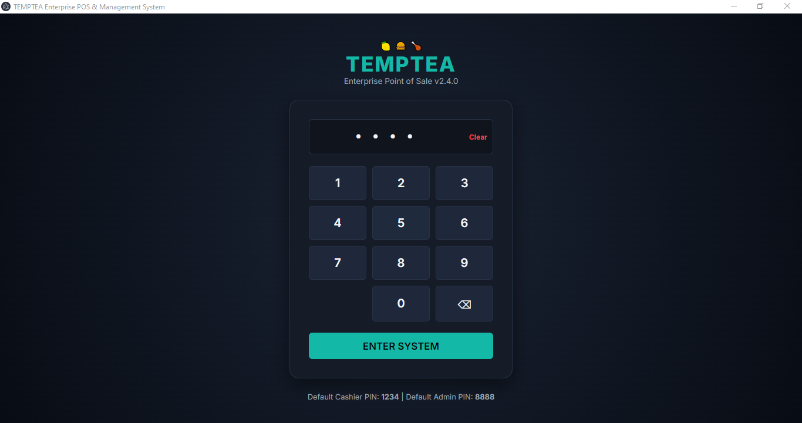
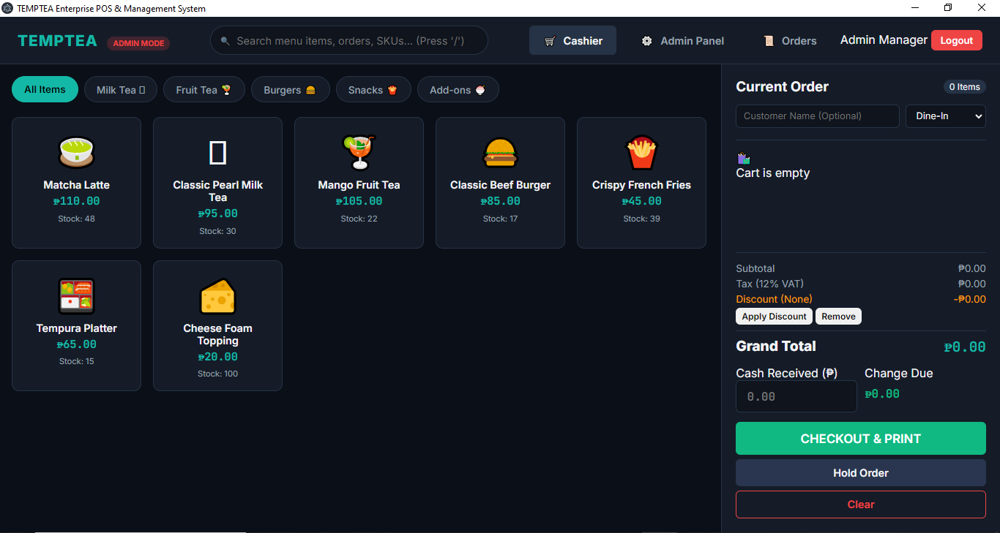
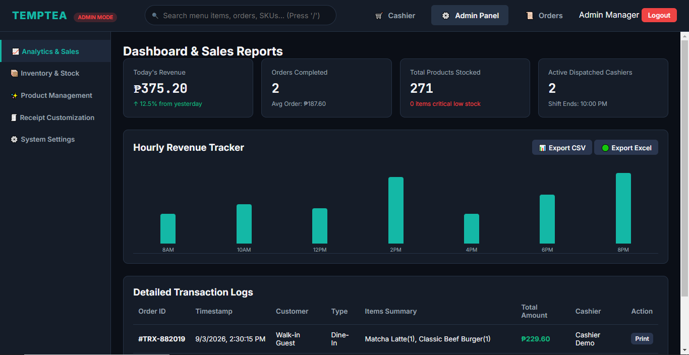
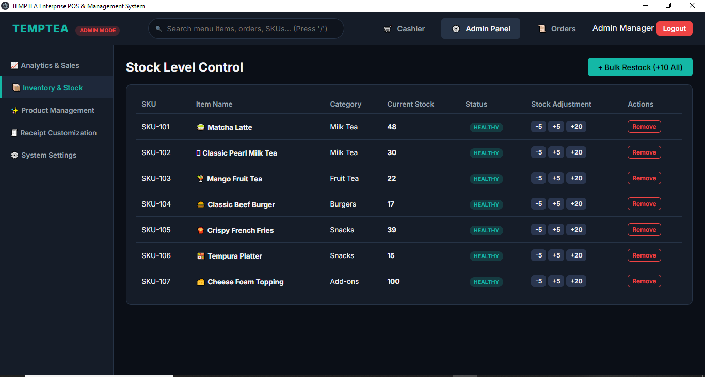
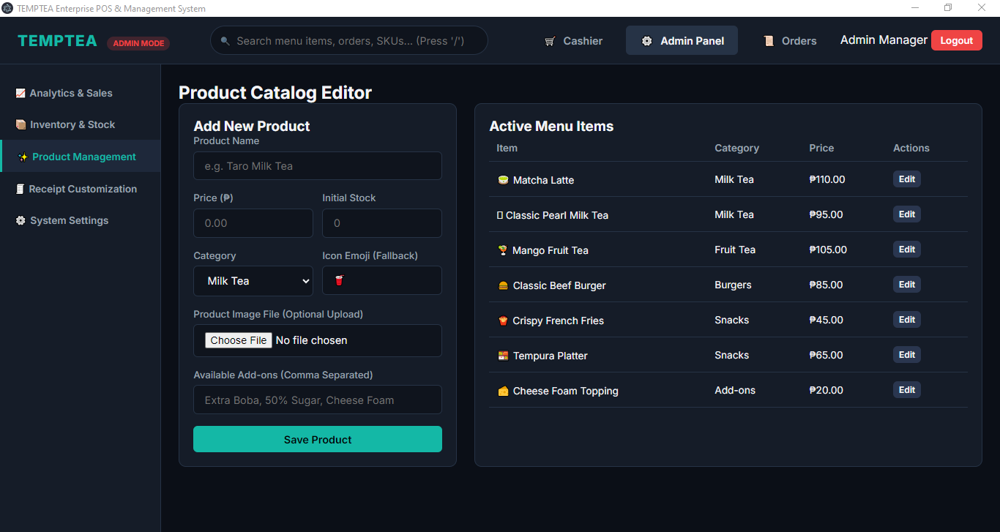
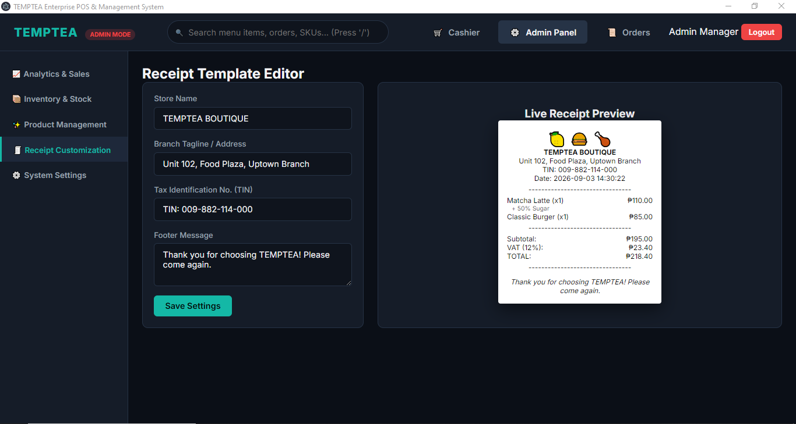
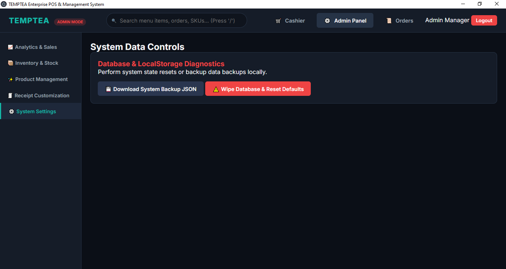
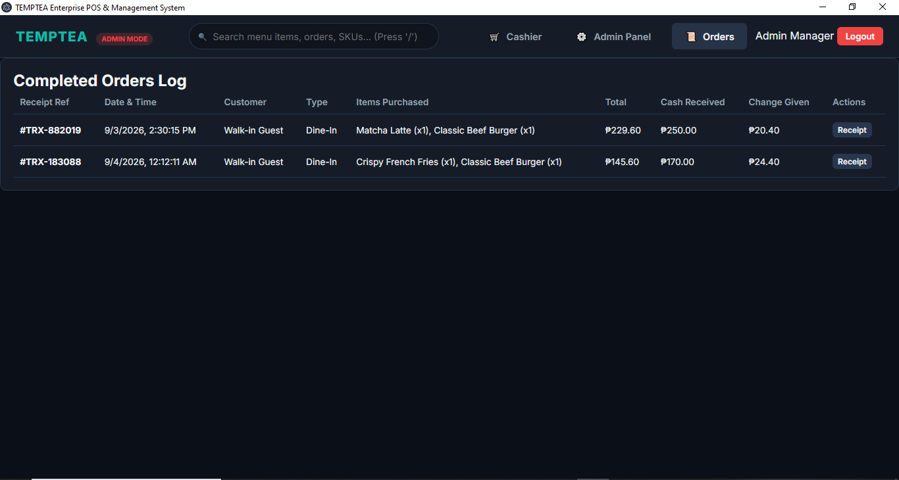

# Wireframes Index & Screen Assignments
# TEMPTEA POS Enterprise Application

## Documentation & Deliverables
* [Agile Product Backlog & Wireframe Mapping](docs/backlog.md)
* [RESTful API Documentation](routes.md)
* [Wireframes Index](docs/backlog.md#wireframes-index--screen-assignments)

Every screen contains happy path, empty state, error state, and delete confirmation step:

| Screen / State | Assigned Designer | Associated Story |
| :--- | :--- | :--- |
| **Product Catalog (List / Detail / Empty / Error)** | Benjie Pahamutang | Products Read/Create |
| **Product Edit / Delete Confirmation** | Benjie Pahamutang | Products Update/Delete |
| **Checkout & Order Creation (List / Detail / Empty)** | Mekyla Bagaporo | Orders Create/Read |
| **Void Order Modal / Error State** | Mekyla Bagaporo | Orders Delete/Update |
| **Loyalty Customer Search (List / Detail / Empty)** | Janila Harina Mino | Customer Read/Create |
| **Loyalty Point Redemption / Error State** | Janila Harina Mino | Customer Update/Delete |
| **Staff Profile & Shift Drawer (List / Detail)** | Norie Jhon Cepriano | Profiles Read/Create |
| **Staff PIN Reset & Deactivation Confirmation** | Rome Jean Quistorio | Profiles Update/Delete |

*Note: Wireframe image files (`.png` / `.fig` / `.excalidraw`) for each state are stored in this directory.*

---

## Application Screenshots & Feature Previews

1. **User Authentication / PIN Entry**  
   

2. **POS Ordering Interface**  
   

3. **Dashboard Analytics & Sales Metrics**  
   

4. **Product Catalog Management**  
   

5. **Product Creation & Form Validation**  
   

6. **Receipt Generation & Printing**  
   

7. **Security Alert & Role Access Control**  
   

8. **Transaction & Order History Logs**  
   